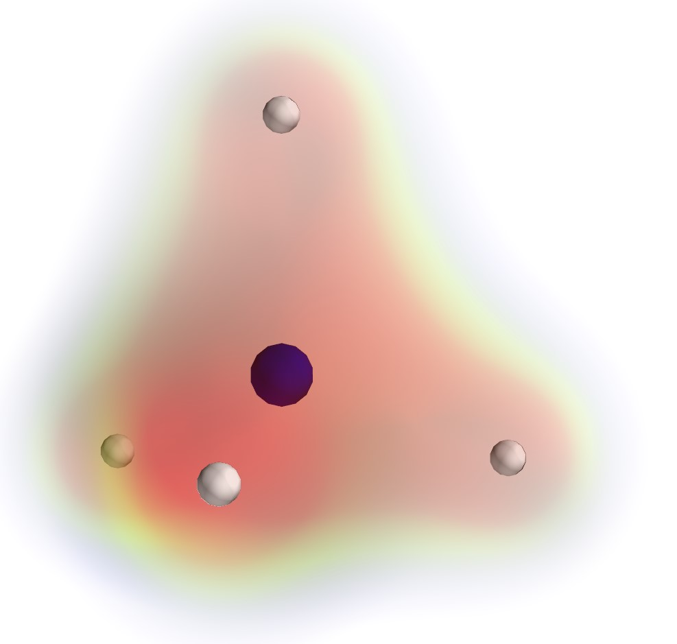

# PyHF

Python Hartree-Fock implementation. Both RHF and UHF are implemented.

## Usage

    python -m PyHF [input.json]

A example input is shown in [h2.json](example/h2.json). General specification of json is

- name;
- hftype (optional): rhf/uhf;
- basis_set: currently only sto-3g;
- atoms: list of atoms (currently only H to F);
- coords: atom coords, Nx3 array;
- charge (optional): net charge of molecule;
- n_single_electron: required in UHF;
- n_step (optional);
- post_analysis (optional): available options:
    - orbital-energy
    - density-matrix
    - charge-muliken
    - plot: If plot is specified, a prompt will appear after calculation, which accepts
        * "charge"
        * number representing orbital: 1,2,3,... in RHF, 1a,2b,... in UHF; Can be seperated by space.
        * "homo": will show number of HOMO
        * "q": exit
    - ci: Performing configuration interaction calculation, compatible with scan. Currently only single-excitation with closed shell system (RCIS) is available. To perform CI, post_analysis must be in _object format_ (e.g. "{key:data}"), see [hf-ci.json](example/hf-ci.json) as example.
- scan (optional): accept two types of input:
    - "variable":\[start:stop:step]: will create an array from start to (included) stop; Currently only accepts a single variable.
    - "i,j":math expression of variable: will change the value of element i,j (start from 1) of coordinates according to expression.
- verbose: full/normal/minimal/silent;

## Install

Python3 and numpy, scipy is required. Python module _mayavi_ is required to plot.

